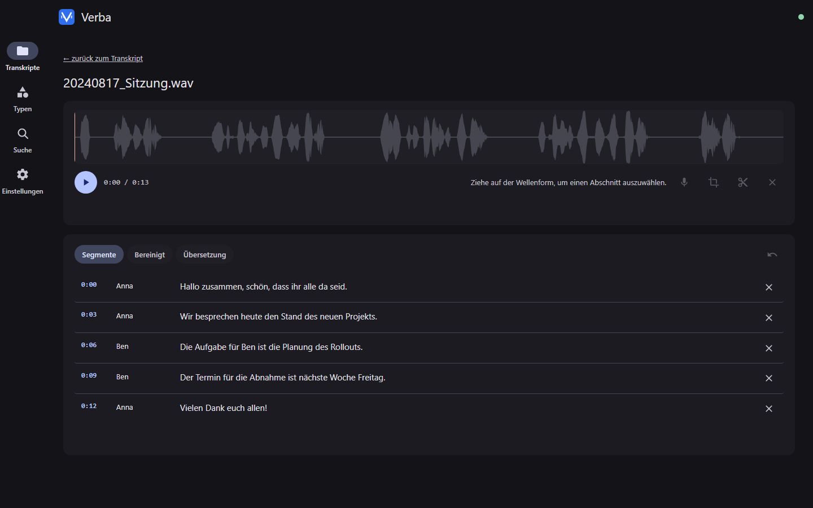
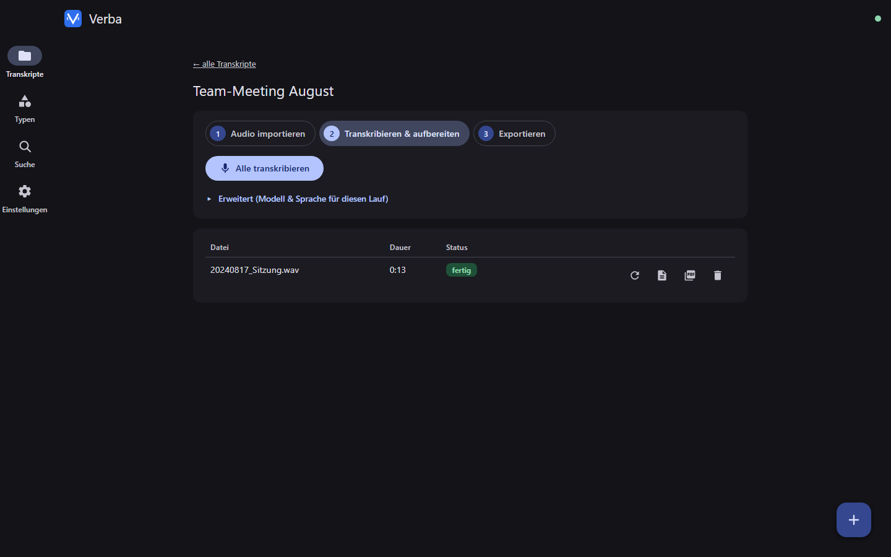
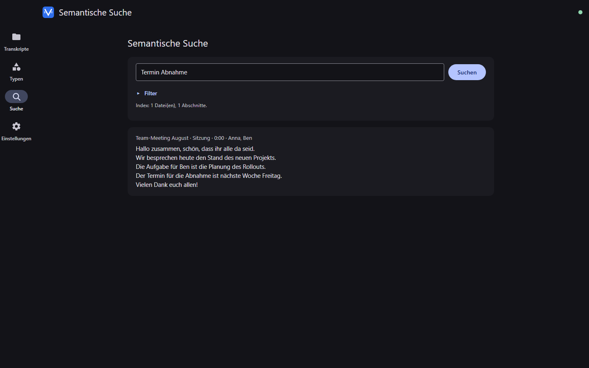
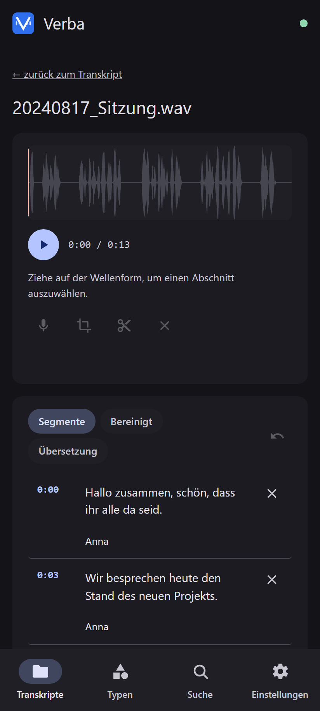

# Verba

Cross-platform transcription tool: audio files and entire folders are transcribed
with **faster-whisper**, optionally cleaned up and translated by an LLM, refined in
an editor with an audio timeline, exported as PDF, and made searchable through a
local semantic search. Plus an OpenAI-compatible transcription API for external
programs. Everything runs locally — no cloud required.

**Feature set**

- Transcription (faster-whisper, GPU with CPU fallback), live progress, fair
  queue for multiple users
- Editor with waveform, segment editing, speakers, range re-transcription
  and audio cutting
- AI processing (cleanup, translation into nearly any language) via a local
  LLM (managed llama.cpp server) or an OpenAI-compatible endpoint
- Transcript types with their own prompts (interview, song, role play, …) and
  type-aware **PDF export** (single or compiled)
- **Semantic search** across all transcripts (hybrid: full text + embeddings,
  timestamp jump marks, AI answers with sources)
- **Public API**: `POST /v1/audio/transcriptions` in the OpenAI wire format,
  API key management in the settings
- PWA (mobile first, de/en/ru, offline-capable interface), Material 3 design

## Screenshots



| Transcript project | Semantic search |
|---|---|
|  |  |



## Installation

Ready-made packages are on the [releases page](../../releases):

| Package | For | Installation |
|---|---|---|
| `Verba-Setup-<version>.exe` | Windows desktop | double-click → wizard → start menu entry |
| `Verba-<version>-x86_64.AppImage` | Linux desktop | make executable, double-click |
| `verba-server-<version>.zip` | Linux server (headless) | unpack, `sudo ./deploy/install.sh` |

On first start, the **in-app first-run setup** checks the system and installs
missing components (ffmpeg, Whisper, PDF export, search) automatically with live
progress. An existing ffmpeg installation is used; otherwise a static build is
set up.

### From source

Prerequisite: Python 3.11+ ([python.org](https://www.python.org) or your package manager).

**Windows:** double-click `start.bat` — **Linux/macOS:**

```bash
./start.sh
```

The first start automatically creates a virtual environment and installs the
core dependencies; the application then opens in the browser
(`http://127.0.0.1:8710`).

## Server Operation

```bash
./start.sh --server --port 8710
```

Binds to `0.0.0.0`, opens no browser, and is reachable via IP, domain or reverse
proxy. Health check: `GET /health`. All URLs are relative — running behind
nginx/Caddy/Traefik works without special configuration; the WebSocket (`/ws`)
must be forwarded.

Ready-made templates live under [`deploy/`](deploy/): systemd unit,
nginx and Caddy example configuration (incl. WebSocket and upload limits) and
`install.sh` for the complete server setup. For running the public API on a
network, create a key in the settings under "API".

More options: `python run.py --help` (`--host`, `--port`, `--no-browser`, `--data-dir`).

## Directories

| Path | Contents |
|---|---|
| `data/` | settings (`settings.json`), database, logs (with rotation), models, tools |
| `workspaces/` | one folder per transcript project (audio, transcripts, exports) |

Both paths are configurable. Installed desktop builds store data per user
(`%LOCALAPPDATA%\Verba` or `~/.local/share/verba`).

## Development

```bash
python -m pip install -r requirements/core.txt -r requirements/dev.txt
python -m pytest tests/ -q
python -m ruff check backend/ tests/ run.py
```

Details on architecture, packaging and the release pipeline: [DEVELOPER_GUIDE.md](DEVELOPER_GUIDE.md). Guidelines
for code agents: [CLAUDE.md](CLAUDE.md) and [AGENTS.md](AGENTS.md). The
user guide (de/en/ru) is available in the app under Settings → Documentation
and lives under [`docs/user/`](docs/user/).
